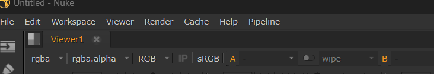
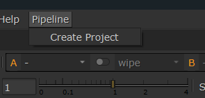
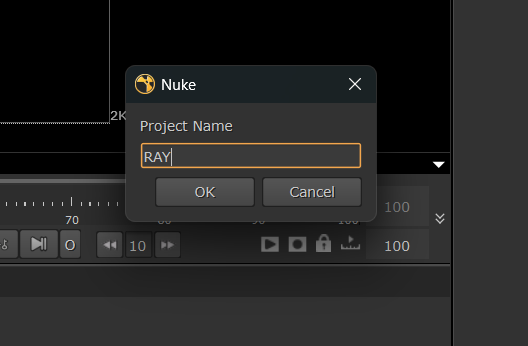
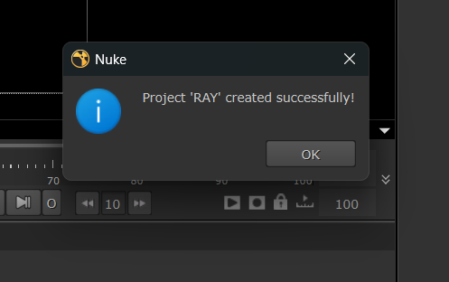
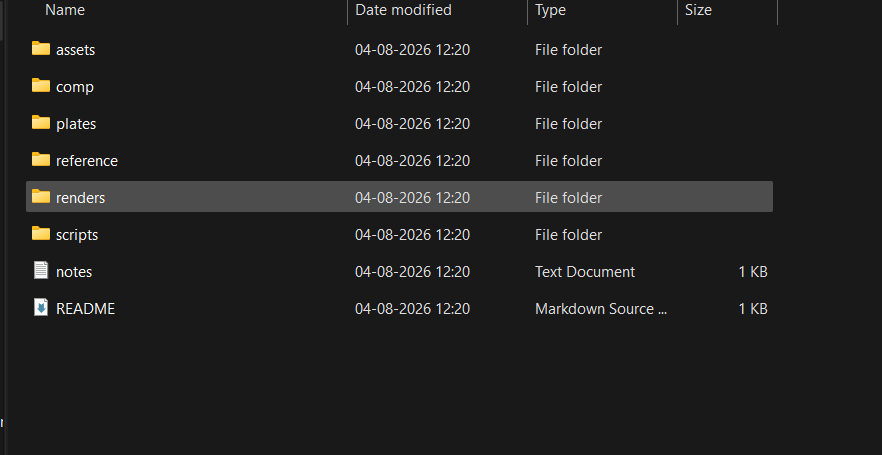

# Python Project Creator for Nuke

A simple pipeline tool that creates a VFX project folder structure directly from inside **Nuke**.

---

## Features

- Create project folders automatically
- Generate `README.md` and `notes.txt`
- Create a starter `.nk` file
- Launch from **Nuke → Pipeline → Create Project**
- Uses **Python + Nuke API**

---

## Nuke Integration

### Pipeline Menu



### Create Project Popup



---

## create project name



## project creation



## Folder structure



---

## Project Structure

```text
python_project_creator/
│
├── project_creator.py
├── config.json
├── README.md
├── screenshots/
│   ├── nuke_menu.png
│   ├── create_project_popup.png
│   └── generated_folders.png
└── nuke_integration/
    ├── menu.py
    └── install_in_nuke.txt
```